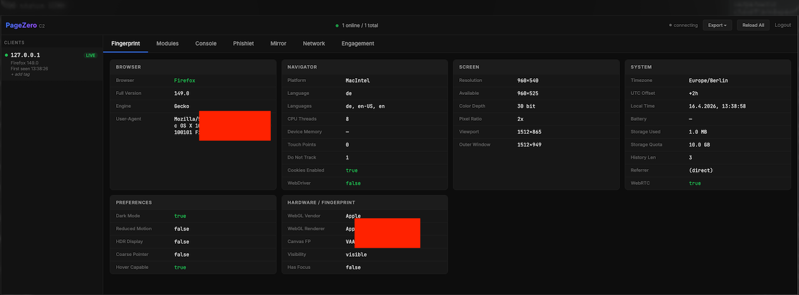
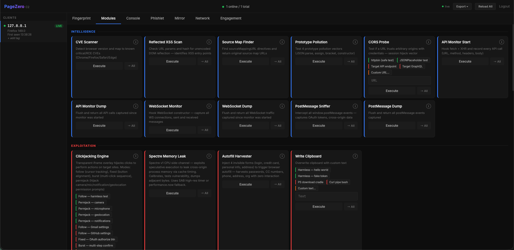
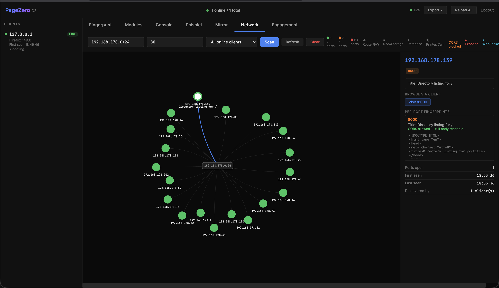
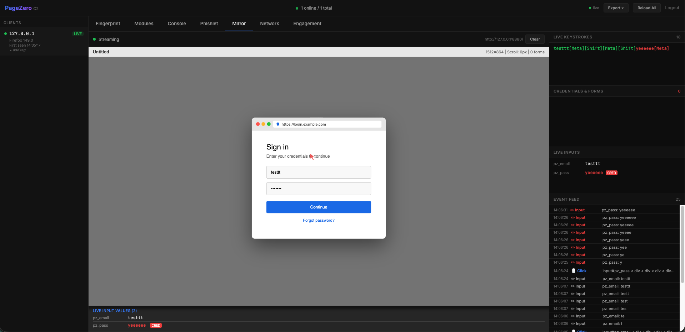

# PageZero — Browser Exploitation Framework

> **Built with AI assistance in ~2 days. Expect bugs. Works on my machine — no guarantees elsewhere.**
<p align="center">
  
</p>


A JavaScript-based browser exploitation and C2 framework. Think of it as a mix between **Evilginx** and **BeEF** — Evilginx-style phishing delivery (MITM, no phishlets required) combined with BeEF-style in-browser hooking and module execution. Once a target loads your hook, you get a live session with access to 40+ modules: credential theft, keylogging, LAN scanning, session mirroring, social engineering overlays, CPU side-channels, and more — all from a web admin panel.

---

## Disclaimer

**PageZero is intended exclusively for authorized penetration testing, CTF competitions, security research, and controlled lab environments.**

Using this tool against systems you do not own or lack explicit written authorization to test is illegal under the Computer Fraud and Abuse Act (CFAA), the Computer Misuse Act, and equivalent laws in your jurisdiction. The author accepts zero liability for misuse. By using this software you confirm you have proper authorization for every target.

---

## How It Works

PageZero draws inspiration from two well-known attack frameworks:

- **[Evilginx](https://github.com/kgretzky/evilginx2)** — MITM-based delivery without phishlets. No per-site reverse proxy config, no YAML files to maintain. Just serve the hook.
- **[BeEF](https://github.com/beefproject/beef)** (Browser Exploitation Framework) — Once the hook loads, you get a persistent in-browser agent. Run modules, chain attacks, harvest data, control the browser in real-time from the admin panel.

The key difference: PageZero combines both approaches in one tool. No phishlets, no Ruby stack, no complex setup — a single Python server and a JS snippet.

**Typical attack flow:**

```
1. Serve hook.html to victim
   └─ via MITM, XSS, phishing link, malicious ad, iframe injection, etc.

2. Victim's browser loads the agent
   └─ Fingerprint collected → client appears in admin panel

3. Operator runs modules from the admin panel
   └─ Modules execute silently in victim's browser context
   └─ Results stream back in real-time via SSE

4. Harvest credentials, scan LAN, mirror session, deploy overlays
   └─ Everything runs in-browser — no browser extension, no downloads
```

Because the agent runs in the victim's page context, it has access to everything that page can access: cookies, localStorage, DOM content, form data, clipboard, media devices, and the local network the victim's machine is connected to.

---

## Modules

| Category | Modules |
|----------|---------|
| **Recon** | Cookie Grab, Sensitive Data Scan, JWT Analyzer, History Sniff, Geolocation, Read Clipboard, Device Enum, Sandbox Detect, Permissions Policy, CPU Arch, Extension Detect, Login Oracle |
| **Social Engineering** | Browser-in-Browser (BitB), Tab Napper, Close Overlays, Notification Prompt |
| **Persistence** | Start Keylogger, Stop Keylogger, Form Grabber, Credential Monitor, Clipboard Monitor, Session Mirror |
| **Intelligence** | CVE Scanner, Reflected XSS Scan, Source Map Finder, Prototype Pollution Probe, CORS Probe, API Monitor, WebSocket Monitor, PostMessage Sniffer, PostMessage Dump |
| **Network** | LAN Scanner, Local URL Fetch, LAN Proxy, WebRTC Network Enum |
| **Exploitation** | Clickjacking Engine, Spectre Memory Leak, Autofill Harvester, Write Clipboard |
| **Media** | Screen Capture, Webcam Capture |
| **Browser Control** | Redirect, Open Tab, Alert Dialog, Reload, Replace Body, Execute JS |

---

## Installation

**Requirements:** Python 3.9+

```bash
# Clone
git clone https://github.com/baum1810/pagezero.git
cd pagezero

# Virtual environment
python3 -m venv venv
source venv/bin/activate      # macOS / Linux
# venv\Scripts\activate       # Windows

# Dependencies
pip install -r requirements.txt
```

---

## Running

```bash
# HTTP on port 8880 (default)
python app.py

# Custom port
python app.py --port 9000

# HTTPS (requires pagezero.key + pagezero.pem in project root)
python app.py --ssl
```

Admin panel: `http://localhost:8880/login`

```
Username: admin
Password: pagezero
```

> Change these before any real deployment — they are hardcoded in `app.py`.

---

## Architecture

```
┌─────────────────────────────────────────────────────┐
│  Target Browser                                     │
│  hook.html → fingerprint → poll every 2s → exec    │
└──────────────────────┬──────────────────────────────┘
                       │ HTTP
┌──────────────────────▼──────────────────────────────┐
│  Flask C2 Server — port 8880                        │
│  Session mgmt · Command queue · SQLite · SSE        │
└──────────────────────┬──────────────────────────────┘
                       │ SSE + HTTP
┌──────────────────────▼──────────────────────────────┐
│  Admin Panel                                        │
│  Clients · Modules · Mirror · Network Map · Audit   │
└─────────────────────────────────────────────────────┘
```

| File | Role |
|------|------|
| `app.py` | Flask backend — routes, session mgmt, command queue, SSE, SQLite |
| `templates/hook.html` | JS agent injected into victim browser |
| `templates/admin.html` | Operator control panel |
| `modules/*.js` | ~40 individual exploitation modules |

---



## Admin Panel Tabs

| Tab | What it does |
|-----|-------------|
| **Clients** | All live sessions — IP, UA, last seen |
| **Fingerprint** | Full browser fingerprint for selected client |
| **Modules** | Run any module on one client or broadcast to all |
| **Network Map** | Live LAN device graph from scan results |
| **Mirror** | Real-time DOM snapshots + keystroke/click replay |
| **Audit** | Append-only compliance audit log |
| **Settings** | Engagement config, killswitch, data export |

---

## Module Details

### Recon

**Cookie Grab** — Reads all cookies, localStorage, sessionStorage, lists IndexedDB database names, service worker registrations, and Cache Storage keys. Returns everything as JSON.

**Sensitive Data Scanner** — Runs 26+ regex patterns (JWTs, AWS keys, Bearer tokens, private keys, Discord/Stripe/GitHub/Slack/Google OAuth tokens, and more) against DOM text, cookies, localStorage, inline scripts, meta tags, and URL parameters.

**JWT Analyzer** — Finds JWTs in cookies and localStorage, decodes header and payload, checks expiry and algorithm (`alg:none`, `HS256` flagged as weak).

**History Sniff** — Cache-timing side-channel against 40+ domains (banks, crypto exchanges, email, VPNs). Measures `` and DNS prefetch load times — cache hit < 30ms reveals visited sites. Returns categorized list.

**Geolocation** — Calls `navigator.geolocation.getCurrentPosition()`. Silent if permission previously granted.

**Read Clipboard** — Calls `navigator.clipboard.readText()`. Prompts for permission on first call.

**Device Enumeration** — Enumerates cameras, microphones, speakers via `mediaDevices.enumerateDevices()`. If media permission previously granted, returns full device labels including model names.

**Sandbox / VM Detector** — Scores 7 signals (WebDriver flag, GPU renderer, JIT speed, timer resolution, CPU cores, plugin list, screen resolution). Verdict: `LIKELY_REAL_USER`, `SUSPICIOUS`, or `LIKELY_SANDBOX_OR_VM`.

**Permissions Policy** — Reads `document.permissionsPolicy` to detect enterprise/MDM lockdowns.

**CPU Microarchitecture Fingerprint** — Cache-line timing probe infers CPU family (Apple Silicon, Intel gen, AMD Zen). No permissions needed.

**Extension Detector** — Global namespace probes + URL timing checks for MetaMask, 1Password, Tampermonkey, crypto wallets, password managers.

**Login Oracle** — Uses `window.length` oracle to detect logged-in state for Google, Facebook, GitHub, Discord, Slack.

---

### Social Engineering

**Browser-in-Browser (BitB)** — Replaces page content with fake login overlay when user switches tabs. Classic reverse-tabnapping.

**Browser-in-Browser (BitB)** — Fake browser popup overlay with draggable window chrome, address bar, and SSL padlock. Ships with a generic login template. Add your own templates in `modules/bitb_phish.js` under the `TEMPLATES` object — no company branding included. Real browser URL bar is unaffected.

**Close Overlays** — Removes all active PageZero overlays.

**Notification Prompt** — Calls `Notification.requestPermission()`. If allowed, enables persistent desktop notifications through the Service Worker channel.

---

### Persistence

**Keylogger** — Captures keystrokes and input field values (with element context and URL) every 2 seconds. `keylogger_start` / `keylogger_stop`.

**Form Grabber** — Hooks all form submit events (existing + dynamically added via MutationObserver). Captures all field types including passwords before browser sends the POST.

**Credential Monitor** — Watches pre-filled password/email fields and intercepts form submits continuously.

**Clipboard Monitor** — Captures text on every `copy` and `cut` event. No permissions required.

**Session Mirror** — Every 2 seconds: full DOM snapshot (scripts stripped, URLs rewritten to absolute), all input values including passwords, keystroke + click stream. Live-streamed to admin via SSE. DOM capped at 500 KB, history at 500 snapshots.

---

### Intelligence

**CVE Scanner** — Gets exact browser version via `userAgentData.getHighEntropyValues()`, cross-references 60+ CVEs with CVSS scores, ITW exploitation status, PoC availability. Returns verdict: `PATCHED` / `MEDIUM` / `HIGH` / `CRITICAL`.

**Reflected XSS Scan** — Checks URL params and hash for unencoded DOM reflection.

**Source Map Finder** — Finds `sourceMappingURL` directives in scripts. Fetching those maps reveals original unminified source code.

**Prototype Pollution Probe** — Tests 4 pollution vectors: `JSON.parse`, `Object.assign`, bracket notation, constructor access.

**CORS Probe** — Sends credentialed fetch with forged `Origin` header. Detects `Access-Control-Allow-Origin` reflection with `Allow-Credentials: true`.

**API Monitor** — Wraps `fetch` and `XHR` to record every outbound API call silently. `api_monitor_start` / `api_monitor_dump`.

**WebSocket Monitor** — Hooks `WebSocket` constructor, captures all connections and messages. `ws_monitor_start` / `ws_monitor_dump`.

**PostMessage Sniffer / Dump** — Records all `window.postMessage` events including OAuth code/token exchanges.

---

### Network



**LAN Scanner** — Two-phase browser-based internal network scanner. Phase 1: host discovery via `fetch()` timing. Phase 2: port scan + device fingerprinting (50+ signatures: routers, NAS, hypervisors, cameras, IoT, CI/CD). No permissions required — works because TCP connection timing/error type reveals reachability even when CORS blocks response body.

Parameters:
- `""` — auto-detect subnet, port 80
- `"192.168.1.0/24"` — CIDR
- `"192.168.1.1-50"` — range
- `"192.168.1.0/24 80,443,8080-8090"` — CIDR + port range

**Local URL Fetch** — Relays a LAN URL through the victim's browser. Returns body when CORS allows, headers + timing otherwise.

**LAN Proxy** — Full proxy fetch: returns body (text or base64 binary), headers, content-type. Browse internal services through the victim.

**WebRTC Network Enum** — ICE candidate enumeration reveals all network interfaces (LAN, VPN tun, Docker bridges, public IP via STUN). Zero permissions required.

---

### Exploitation



**Clickjacking Engine** — Transparent `<iframe>` overlay hijacks clicks to target site.

| Mode | Usage |
|------|-------|
| `follow:URL` | Full-viewport 0.01-opacity iframe; every click hits target |
| `fixed:URL,x,y` | iframe at fixed coords, bait button over target button |
| `burst:URL` | Rapid repositioning to click sequence of targets |
| `permjack:camera` | Hijack browser permission prompts |

**Spectre Memory Leak** — JavaScript Spectre v1 side-channel. Builds high-res timer via `SharedArrayBuffer` + Worker, calibrates cache-hit/miss thresholds, exploits speculative execution to leak adjacent memory bytes via cache timing. Reports vulnerability status and leaked bytes.

**Autofill Harvester** — Injects 4 invisible forms with precise `autocomplete` attributes (login, credit card, personal info, address), focuses each field to trigger autofill, reads back populated values after 500ms. Zero visible UI.

**Write Clipboard** — Overwrites clipboard via `navigator.clipboard.writeText(param)`.

---

### Media

**Screen Capture** — Shows subtle overlay button. On click, calls `getDisplayMedia()` (browser's screen share picker). Captures single full-resolution frame as JPEG.

**Webcam Capture** — `getUserMedia({video:true})` → single JPEG frame → stops stream immediately.

---

### Browser Control

**Redirect** — `location.href = param`

**Open Tab** — `window.open(param)`

**Alert Dialog** — `window.alert(param)`

**Reload** — `location.reload()`

**Replace Body** — `document.body.innerHTML = param`

**Execute JS** — `eval(param)` with try-catch. General-purpose code execution on victim page.

---

## Engagement & Compliance

Before running modules, create an engagement via **Settings → New Engagement**:

| Field | Purpose |
|-------|---------|
| Client | Target organization |
| Contract Ref | SOW / pentest contract reference |
| Authorized Domains | In-scope domains (comma-separated) |
| Start / End | Time window enforcement |

Server enforces time window and scope on every execution. All actions written to append-only `audit_log` — records cannot be deleted.

---

## Database Schema

```sql
CREATE TABLE sessions (cid TEXT PRIMARY KEY, ip TEXT, ua TEXT, first_seen REAL, last_seen REAL, data TEXT);
CREATE TABLE commands (id TEXT PRIMARY KEY, cid TEXT, module_id TEXT, module_name TEXT, ts REAL, result TEXT, result_ts REAL);
CREATE TABLE engagements (id TEXT PRIMARY KEY, client TEXT, contract_ref TEXT, authorized_domains TEXT, start_ts REAL, end_ts REAL, operator TEXT, created_ts REAL, active INTEGER DEFAULT 0);
CREATE TABLE audit_log (id INTEGER PRIMARY KEY AUTOINCREMENT, ts REAL, operator TEXT, event TEXT, detail TEXT);
```

---

## API Reference

| Method | Route | Description |
|--------|-------|-------------|
| GET | `/` | Serve hook agent |
| POST | `/collect` | Receive client fingerprint |
| GET | `/poll/<cid>` | Dequeue command for client |
| POST | `/result` | Receive module result |
| GET/POST | `/login` | Admin auth |
| GET | `/admin` | Admin panel |
| GET | `/api/clients` | List all clients |
| POST | `/exec/<cid>` | Execute module on client |
| POST | `/exec/all` | Broadcast to all clients |
| GET | `/api/stream` | SSE event stream |
| GET | `/api/mirror/<cid>` | Session mirror data |
| GET | `/api/network/map` | LAN network map |
| GET/POST | `/api/engagement` | Manage engagement |
| GET | `/api/audit` | Audit log |
| GET | `/pz-reset` | Reset database |
